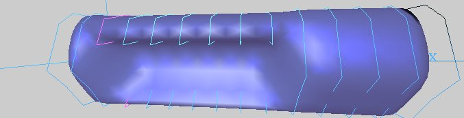

# cadauno
3D modeling with NURBS surfaces

This is CADauno, a free open source 3D modeling tool written in C++ and based on OpenGL.

CADauno works with NURBS surfaces. It aims at exploiting the NURBS power at representing free forms, 
as NURBS are the industry standard for the representation and design of geometry. 
It's written in C++, it depends on 

* OpenGL
* GLUT
* GLUI
* FreeImage

This tool provides an interpolation facility ("skinning" technique) which enables the designer 
to create a closed surface passing through different section curves. 
So it will be possible, as an example, to build a human body 3D model 
starting from sections provided by a Computed Axial Tomography scanner.

## prerequisites

- download Visual Studio 2022 for windows10
- install Visual Studio 2022 from the downloaded .exe file
- select the C++ components to be installed
- Now download GLUT header file, the .LIB, and .DLL files all pre-compiled for Intel platforms, 
from the archive [glutdlls37beta.zip](https://www.opengl.org/resources/libraries/glut/glutdlls37beta.zip).
- After this, we have to copy the file as instructed below:

First, paste __glut.h__ file in:
C:\Program Files\Microsoft Visual Studio\2022\Community\VC\Auxiliary\VS\include\GL

Then paste __glut.lib__ in:
C:\Program Files\Microsoft Visual Studio\2022\Community\VC\Auxiliary\VS\lib\x64
 
Then paste the __glut32.lib__ in:
C:\Program Files\Microsoft Visual Studio\2022\Community\VC\Auxiliary\VS\lib\x86

Then copy __glut.dll__ and __glut32.dll__ to C:\Windows\SysWOW64
 
Finally  copy __glut32.dll__ to C:\Windows\System32 

## compile in Visual Studio Community 2022
compile the CADauno project, then copy the following files in the directory containing the executable CADauno.exe,
it might Debug or Release, depending on the project configuration:

- dlls/FreeImage.dll

## compilation
The project must be compiled in 32-bit mode

## usage

in the main window:
	use the arrow keys to move the camera position
	use the keys a z s x d c to move the point looked by the camera
	use the keys + and - to change the zoom

in the section window:
	use the arrow keys to move the camera position
	use the keys + and - to change the zoom
	use n to select the next control point
	
in the operations window, you can load a file (see the _examples_ folders) by typing its name. 
The file must be present in the directory containing the CADauno.exe executable